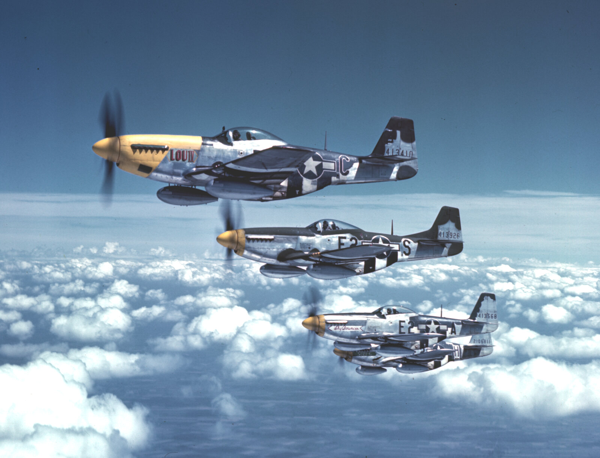
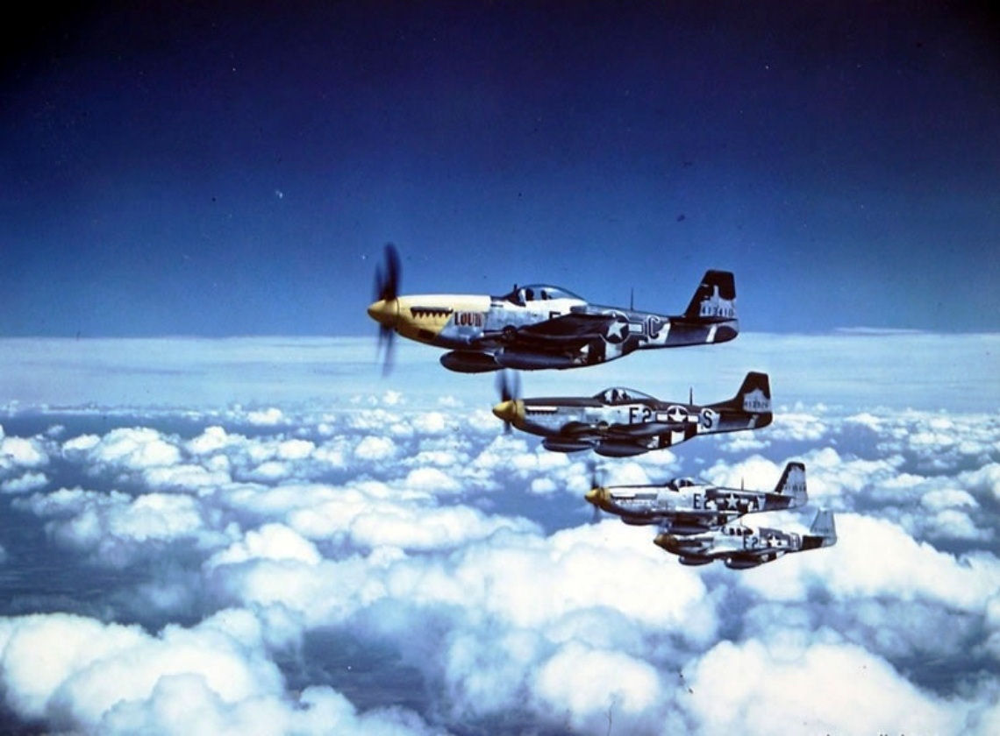

# The Bottisham Four

The "Bottisham Four" are four North American P-51 Mustangs (three P-51Ds and
one P-51B) of the 375th Fighter Squadron, 361st Fighter Group, 8th Air
Force, photographed in close formation from a B-17 camera ship on 26 July
1944 near their base at RAF Bottisham, Cambridgeshire. Lead aircraft E2-C
"Lou IV" — flown by group commander Col. Thomas J.J. Christian Jr. — became
one of the most reproduced Mustang subjects of the war, but none of the four
aircraft survived it: all were lost within a year, two of them within a
fortnight of this photo being taken.

## Images

Both images: public domain (US federal government work, USAAF), sourced via
Wikimedia Commons.

## Aircraft

Each of the four Mustangs has its own subdirectory for aircraft-specific
reference and mask work, named by squadron code.

| Code | Name | Directory | Kit |
|---|---|---|---|
| E2-C | "Lou IV" | [E2-C/](E2-C/) | [Eduard 84172 — P-51D-5 Mustang, 1/48](https://www.scalemates.com/kits/eduard-84172-p-51d-5-mustang--1517046) |
| E2-S | *(no common name)* | [E2-S/](E2-S/) | [Tamiya 61040 — P-51D Mustang "8th AF", 1/48](https://www.scalemates.com/kits/tamiya-61040-north-american-p-51d-mustang-8th-af--115212) |
| E2-A | "Sky Bouncer" | [E2-A/](E2-A/) | not yet chosen |
| E2-H | "Suzy G" | [E2-H/](E2-H/) | not yet chosen |

## Resources

Ranked with modelling reference value in mind first, general history second.

1. [The Bottisham Blues – Making-History](https://making-history.ca/2020/12/30/the-bottisham-blues/) —
   Mark Beckwith's deep-dive into "Lou IV" and E2-A's paint scheme, arguing
   (drawing on researcher Dana Bell's work) that the colour overpainting the
   D-Day stripes on the fuselage spine was actually **blue**, not the darker
   green usually assumed — the "Bottisham Blues" the modelling/history
   community still argues about. Essential reading before painting this
   scheme.
2. [P-51D Mustang "Lou IV" Airfix 1/48 — Britmodeller](https://www.britmodeller.com/forums/index.php?/topic/235131274-p-51d-mustang-lou-iv-airfix-148/) —
   an OOB 1/48 Airfix build of "Lou IV" with Montex masks; the comment
   thread includes modellers actively debating the olive-drab-vs-blue
   question from the Bottisham Blues article above.
3. [1:48 P-51D by Tamiya — 44-13410 "Lou IV" — WW2Aircraft.net](https://ww2aircraft.net/forum/threads/1-48-p-51d-by-tamiya-44-13410-lou-iv.46472/) —
   a multi-page start-to-finish 1/48 Tamiya build log of the same aircraft,
   useful for construction and masking reference photos throughout.
4. [Asisbiz — 361st Fighter Group P-51 Mustang photos](https://asisbiz.com/il2/P-51/361FG.html) —
   a large gallery of period photographs of 361st FG aircraft, useful for
   cross-checking markings and weathering beyond the four famous frames.
5. [The Bottisham Four — This Day in Aviation](https://www.thisdayinaviation.com/tag/the-bottisham-four/) —
   well-sourced written history: unit, pilots, serials, and the fate of each
   of the four aircraft.
6. [Category:361st Fighter Group (USAAF) — Wikimedia Commons](https://commons.wikimedia.org/wiki/Category:361st_Fighter_Group_(United_States_Army_Air_Forces)) —
   source category for full-resolution public-domain originals, including
   the two images above, for further detail crops.
